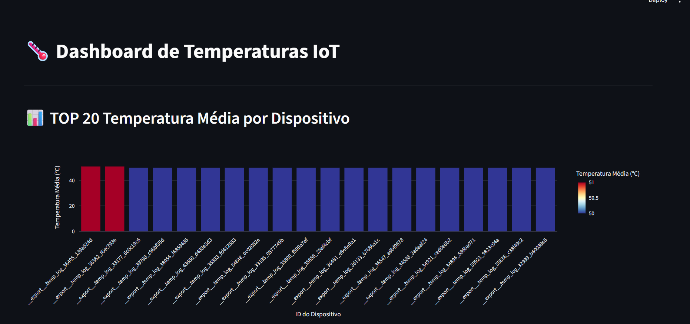
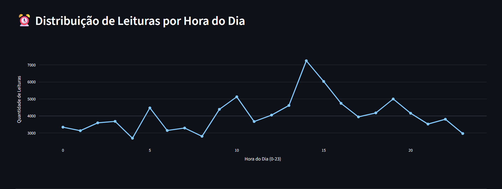
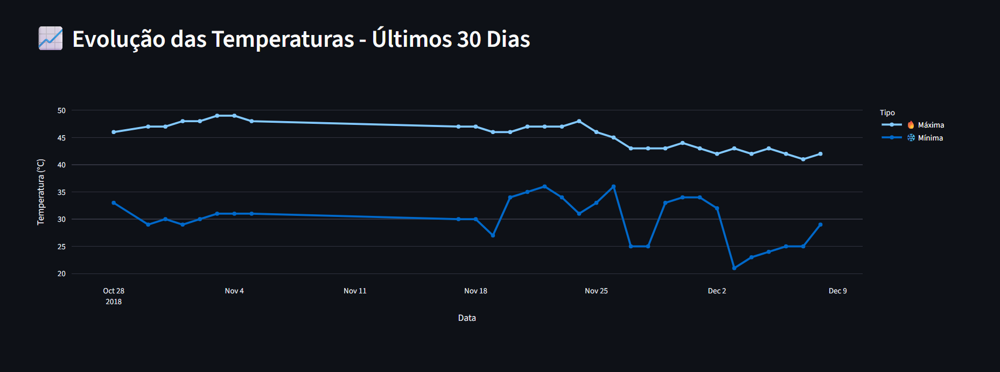

# 🌡️ Dashboard IoT de Temperatura

Este projeto consiste em um **dashboard interativo de leituras de temperatura de dispositivos IoT**, construído com **Python**, **Streamlit** e **Plotly**, consumindo dados de um **banco PostgreSQL**.  

O dashboard permite visualizar métricas gerais, gráficos de média por dispositivo, distribuição por hora e evolução de temperaturas máximas e mínimas.

---

## 📂 Estrutura do Projeto

Pipeline-de-Dados-com-IoT-e-Docker/
├── src/
│   └── dashboard.py        # Script principal do Streamlit
├── data/
│   └── carregarDados.py    # Script para importar CSV para o PostgreSQL
├── docs/
│   └── IOT-temp.csv        # Dataset CSV
├── requirements.txt        # Lista de dependências Python
├── docker-compose.yml      # Configuração do Docker para PostgreSQL
└── README.md               # Este arquivo com instruções do projeto

imgs/ # Pasta com as capturas de tela
ParteTeorica.pdf # Documentação em pdf

link para o video: 

---

## ⚙️ Configuração do Ambiente

### 1. Clonar o repositório
```bash
git clone https://github.com/AdrianoMoura618/Pipeline-de-Dados-com-IoT-e-Docker.git
cd Pipeline-de-Dados-com-IoT-e-Docker
````

### 2. Criar ambiente virtual

```bash
python -m venv venv
# Windows
venv\Scripts\activate
# macOS/Linux
source venv/bin/activate
```

### 3. Instalar dependências

```bash
pip install -r requirements.txt
```

### 4. Subir o PostgreSQL com Docker Compose

```bash
docker-compose up -d
```

O banco estará disponível em `localhost:5432` com:

* Usuário: `postgres`
* Senha: `senha123`
* Banco: `iotdb`

---

## 🚀 Carregando os Dados

Antes de rodar o dashboard, importe o CSV para o banco PostgreSQL usando o script:

```bash
python data/carregarDados.py
```

O script irá:

* Ler o arquivo `IOT-temp.csv` da pasta `docs/` ou `data/`.
* Criar a tabela `iot_temperaturas` no banco `iotdb`.
* Criar as views SQL necessárias:

  * `avg_temp_por_dispositivo`
  * `leituras_por_hora`
  * `temp_max_min_por_dia`

Depois de executar este script, o banco estará pronto para uso pelo dashboard.

---

## 🚀 Executando o Dashboard

Entre na pasta `src` e execute:

```bash
cd src
streamlit run dashboard.py
```

O dashboard estará disponível em:
[http://localhost:8501](http://localhost:8501)

---

## 🖼️ Capturas de Tela

**Gráfico 1: TOP 20 Temperatura Média por Dispositivo**


**Gráfico 2: Distribuição de Leituras por Hora do Dia**


**Gráfico 3: Evolução das Temperaturas - Últimos 30 Dias**


---

## 📝 Descrição das Views SQL

1. **`avg_temp_por_dispositivo`**

   * Calcula a temperatura média de cada dispositivo.
   * Permite identificar quais dispositivos apresentam maior ou menor média de temperatura.

2. **`leituras_por_hora`**

   * Conta o número de leituras registradas em cada hora do dia.
   * Útil para detectar padrões de atividade dos sensores e horários de pico.

3. **`temp_max_min_por_dia`**

   * Calcula a temperatura máxima e mínima registrada por dia.
   * Permite observar tendências diárias, variações e amplitudes térmicas.

---

## 🔍 Possíveis Insights

* **Dispositivos com maior temperatura média:** podem indicar problemas de aquecimento ou ambientes mais quentes.
* **Pico de leituras por hora:** revela quando os sensores estão mais ativos ou quando há maior movimento/atividade nos locais monitorados.
* **Evolução de temperaturas diárias:** ajuda a identificar dias extremos, oscilações bruscas e padrões sazonais.
* **Amplitude térmica média:** útil para detectar variações incomuns e potenciais falhas nos sensores.

---

## 📦 Tecnologias Utilizadas

* **Python 3.10+**
* **Streamlit** (interface interativa)
* **Plotly Express** (visualizações)
* **SQLAlchemy** (conexão com PostgreSQL)
* **PostgreSQL** (banco de dados)
* **Docker + Docker Compose** (banco isolado e ambiente consistente)

---

## 🛠️ Futuras Melhorias

* Adicionar filtros por dispositivo, período ou região.
* Incluir alertas automáticos para leituras fora do padrão.
* Melhorar layout do dashboard com cores consistentes e KPIs resumidos.
* Adicionar exportação de dados em CSV ou Excel.
